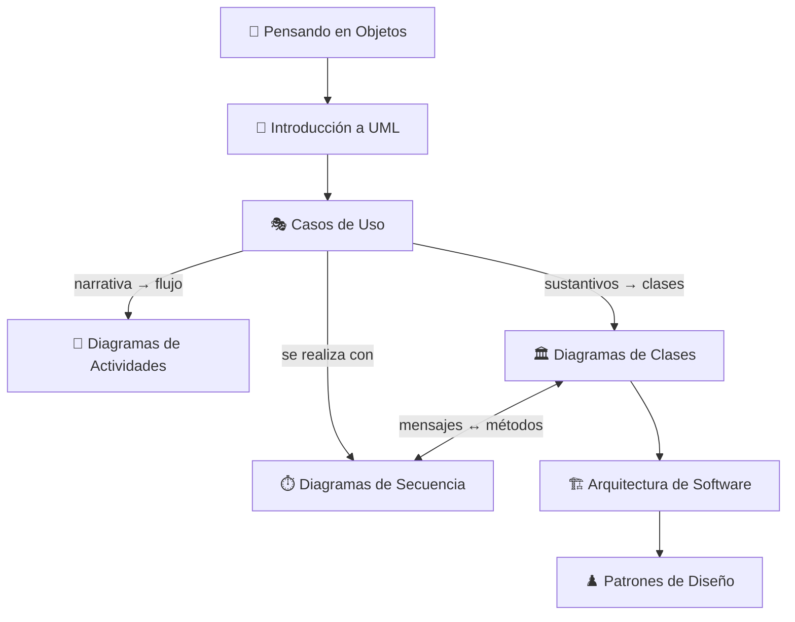

# 📚 Análisis de Sistemas — Resumen del Parcial

> [!abstract] Sobre este resumen
> Mapa de contenido (MOC) de toda la cursada. La materia es **Análisis y Diseño orientado a objetos con UML** (cátedra UP). Cada tema tiene su nota con definiciones, notación, reglas y **errores comunes** sacados de los ejemplos corregidos de la cátedra.

## 🗺️ Recorrido de estudio

> [!tip] Orden sugerido
> Los temas van de lo **conceptual** (objetos, UML) a las **herramientas de modelado** (diagramas), y cierran con la mirada de **diseño/arquitectura**. El flujo natural del análisis es: requerimientos → casos de uso → actividades → clases → secuencia.

## 📑 Temas

1. [[Pensando en Objetos]] — paradigma de objetos: clase, objeto, encapsulamiento, herencia, polimorfismo, generalización.
2. [[Introducción a UML]] — qué es UML, historia, los "tres amigos", método vs. lenguaje, concepto de modelo.
3. [[Casos de Uso]] — actores, narrativa, relaciones `<<include>>` / `<<extends>>`, diagrama de casos de uso.
4. [[Diagramas de Actividades]] — flujo de un caso de uso: bifurcación, fork/join, calles (swimlanes).
5. [[Diagramas de Clases]] — clases, atributos, métodos, visibilidad, relaciones, cardinalidad, herencia.
6. [[Diagramas de Secuencia]] — interacción entre objetos en el tiempo, mensajes, fragmentos `alt`/`loop`.
7. [[Arquitectura de Software]] — estructuras/vistas, estilos, atributos de calidad, rol del arquitecto.
8. [[Patrones de Diseño]] — solución a problemas comunes: creacionales, estructurales, de comportamiento; Singleton.

> [!warning] ⭐ Imprescindible
> [[Checklist de Errores Comunes]] — consolidado de **todos los errores** que la cátedra marcó en los ejemplos corregidos. Repasalo antes de entregar.

> [!question] Autoevaluación
> [[Preguntas Integradoras - Análisis de Sistemas]] — preguntas estilo parcial con respuestas plegadas para repasar.

## 🧭 Clasificación de diagramas UML (referencia rápida)

| Diagrama | Tipo | Qué modela |
|---|---|---|
| Diagrama de **Clases** | **Estructural** (estático) | Las clases del dominio y sus relaciones |
| Diagrama de **Casos de Uso** | Comportamiento (pero **estático**: no muestra secuencia de ejecución) | Funcionalidades del sistema y quién las usa |
| Diagrama de **Actividades** | **Comportamiento** (dinámico) | El flujo/lógica de un caso de uso, con paralelismo |
| Diagrama de **Secuencia** | **Comportamiento** (dinámico) | Interacción entre objetos ordenada en el tiempo |

> [!note] Nota de fidelidad
> El apunte *Introducción a UML* de la cátedra **no enumera** explícitamente la clasificación estructural/comportamiento ni lista los diagramas. Esta tabla resume lo que dice **cada apunte temático** sobre su propio diagrama. Verificá con tu cátedra si piden la taxonomía completa de UML.
