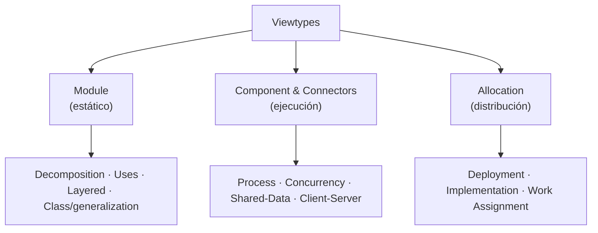

# 🏗️ Arquitectura de Software

> [!info] En contexto
> La mirada de **diseño de alto nivel**: cómo se estructura el sistema. Se apoya en las clases ([[Diagramas de Clases]]) y antecede a los [[Patrones de Diseño]].

## 1. Definición

> [!quote] Qué es
> Es el **set de estructuras (vistas)** del sistema que comprenden: **elementos de SW**, sus **propiedades externamente visibles** y las **relaciones entre ellos**.

| Componente | Ejemplos |
|---|---|
| **Elementos de SW** | Módulos, Objetos, Componentes, Subsistemas, Procesos. |
| **Propiedades externamente visibles** | Servicios que provee, performance, reacción ante fallos. |
| **Relaciones** | Calls, Send-data-to, Synchronizes-with, Uses, Depends, Instantiates. |

- Solo se ocupa del **costado público de las interfaces**. Los **detalles de implementación NO son arquitectónicos**.
- La **abstracción** permite manejar la complejidad; las vistas son **selectivas**.
- ⭐ **"Todo sistema o programa tiene una arquitectura."**

## 2. ¿Por qué es importante?

- **Vehículo de comunicación** entre stakeholders → **lenguaje común**.
- Provee un **blueprint técnico** para construir/modificar/analizar.
- Es el **producto de las primeras decisiones de diseño** → **permite o impide casi todos los atributos de calidad**.
- Abstracción **reutilizable y transferible**.

## 3. Estilo arquitectónico

> [!quote] Definición
> Descripción de **elementos y tipos de relaciones** junto con un **set de restricciones** sobre cómo pueden usarse.

Características de un estilo:
- Set de **elementos** (componentes, procesos, módulos…).
- Set de **conectores / mecanismos de interacción** (call, event, pipe).
- **Topología** (distribución de elementos).
- **Restricciones** sobre topología y comportamiento (ej.: pipelines acíclico).
- **Trade-off** (costos/beneficios; ej.: pipe-and-filter prioriza reutilización sobre performance).
- Un sistema puede **exhibir múltiples estilos a la vez**.

## 4. Viewtypes (tipos de vistas)

> Lo más cercano a "capas" es la vista **Layered**; a cliente-servidor, **Client-Server**. (El PPT **no** desarrolla MVC ni capas presentación/negocio/datos como tales.)

## 5. Rol del arquitecto y stakeholders

> [!quote] El arquitecto
> "Es un **puente** entre los requerimientos del negocio y el sistema a construir." Traduce necesidades de negocio en arquitecturas de calidad: define el problema, los drivers, escenarios y stakeholders; identifica **atributos de calidad**; provee diseño y elige tecnologías.

| Stakeholder | Le interesa |
|---|---|
| **Cliente** | funcionalidad, lifetime, time-to-market, flexibilidad |
| **Usuario** | facilidad de uso, velocidad, disponibilidad |
| **Administradores** | configuración, usuarios, seguridad, backup, recovery |
| **Managers** | costos bajos, objetivos estratégicos, plazos |
| **Developers** | lenguaje, tecnología |

## 6. Atributos de calidad (requerimientos no funcionales) ⭐

> [!quote] Definición
> Propiedad **medible o testeable** que indica qué tan bien el sistema satisface las necesidades. *"Tal vez el tema más importante de la arquitectura… son el principal insumo de un arquitecto."*

| Atributo | Qué mide |
|---|---|
| **Performance** | Respuesta en un intervalo. Métricas: **latencia** y **throughput**. |
| **Availability** | Proporción de tiempo funcional (downtime). |
| **Reliability** | Probabilidad de no fallar en un intervalo. |
| **Usability** | Intuición de uso, accesibilidad, UX. |
| **Reusability** | Reutilización de componentes con pocos cambios. |
| **Interoperability** | Comunicarse con sistemas externos (protocolos, interfaces, formatos). |
| **Maintainability** | Manejar cambios con facilidad. |
| **Manageability** | Facilidad de gestión y monitoreo. |
| **Scalability** | Manejar aumento de carga / expandirse. |
| **Supportability** | Info útil para identificar y resolver problemas. |
| **Security** | Reducir acciones maliciosas/accidentales. |
| **Testability** | Aptitud para crear y ejecutar tests. |

## 7. ¿Qué hace a una buena arquitectura?

> [!example] Citas clave
> - **Ley de Conway:** "Las organizaciones que diseñan sistemas están limitadas a producir diseños que **copian la estructura de comunicación** de sus organizaciones."
> - **Calidad (IEEE):** "El grado en el cual un software posee una **combinación deseada de atributos**."

- **No hay arquitecturas buenas o malas** en abstracto: hay buenas arquitecturas que **resuelven un problema específico en un contexto específico**. Se evalúan según **si cumplen sus objetivos**.

> [!cite] Fuente
> PPT UP *Introducción a la arquitectura*.
