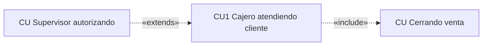

# 🎭 Casos de Uso

> [!info] En contexto
> Las **funcionalidades** del sistema. De acá se derivan los demás modelos: la narrativa se vuelve un [[Diagramas de Actividades|diagrama de actividades]], los sustantivos se vuelven [[Diagramas de Clases|clases]] y cada escenario se realiza con un [[Diagramas de Secuencia|diagrama de secuencia]].

## 1. Qué es un caso de uso

> [!quote] Definición
> "Un caso de uso es una **secuencia de interacciones** entre un sistema y alguien o algo que usa alguno de sus servicios."

- Los casos de uso son **las funcionalidades del sistema**.
- Se relacionan con los **requerimientos** (trazabilidad → permite evaluar impacto de cambios). **Cada requerimiento puede mapear a uno o más casos de uso.**

> [!abstract] Narrativa vs. Diagrama
> - **Narrativa (texto):** descripción detallada de la secuencia de interacciones (nombre, actores, precondición, flujos, poscondición).
> - **Diagrama:** representación gráfica de casos de uso + actores + relaciones. Es **estático**: NO muestra secuencia de ejecución.
> - Ambos sirven para **revisar el sistema con el usuario**.
> - ⚠️ Las narrativas **NO mencionan implementación técnica** (ni lenguaje ni base de datos).

## 2. Actores

> [!quote] Definición
> "Un actor es una **agrupación uniforme** de personas, sistemas o máquinas que interactúan con el sistema **de la misma forma**."

- **Actor principal:** ejecuta el **primer paso** del caso de uso. Aparece en: el **nombre** del CU, los **actores** y el **primer paso**.
- **Actor secundario:** otro que participa (es raro encontrarlos). Ej.: una *supervisora* que autoriza una operación de la cajera.
- **Actor "tiempo / chron / reloj":** cuando la funcionalidad la dispara una **programación** (ej.: reporte diario a las 20 hs), no un humano.

> [!danger] Reglas de oro sobre actores
> - **El SISTEMA nunca puede ser actor de sí mismo.**
> - **SÍ** puede ser actor **otro sistema** (ej.: el sistema de AFIP es actor de nuestro sistema bancario).
> - Si algo **no interactúa con el sistema**, no es actor (ej.: el cliente que mira a la cajera).

## 3. Estructura de la narrativa

| Parte | Qué es |
|---|---|
| **Nombre** | Código + **actor principal + acción en gerundio**. Ej.: *"CU 1.1 Usuario ingresando al sistema"*. |
| **Descripción** | Breve descripción de lo que hace. |
| **Actores** | Los que participan. Al principal se le pone **(P)** o **(Principal)**. |
| **Precondición** | Condición que **se cumple antes** y dispara el CU. **Es raro que un CU tenga precondición.** |
| **Flujo Normal (básico)** | Pasos para llegar al objetivo. |
| **Flujo Alternativo** | Secuencia que surge de una **validación**, numerada respecto al paso (ej.: 4.1, 4.2). |
| **Poscondición** | Estado del sistema tras el flujo normal. |

> [!tip] Reglas de redacción ⭐
> - Reflejar la **interacción actor ↔ sistema** (ida y vuelta), varias veces.
> - **No** decir que el usuario hace clic en un botón si antes el sistema no mostró/habilitó ese botón.
> - Se pueden **agrupar pasos** si los hace el **mismo** sujeto.
> - Las **validaciones** del sistema van en el **flujo normal**; si fallan, derivan al alternativo.
> - Los **mensajes del sistema van entre comillas**. Ej.: *4.2 El sistema muestra "Usuario no existe".*
> - Cada paso = **sujeto (Actor / Sistema) + acción**.

> [!example]- Ejemplo: Cliente retirando efectivo por cajero
> **Flujo Normal:** 1. Cliente ingresa tarjeta → 2. Cajero solicita PIN → 3. Cliente ingresa PIN → 4. Cajero valida PIN → 5. Selecciona "extraer efectivo" → 6. Ingresa monto → 7. Cajero actualiza saldo → 8. Entrega dinero e imprime comprobante.
> **Flujo Alternativo:** 4.1 PIN erróneo, reingrese; 4.2 si lo erra 3 veces retiene la tarjeta; 7.1 sin fondos, expulsa la tarjeta.
> **Poscondición:** "Cliente retiró efectivo del cajero automático."

## 4. Notación del diagrama

| Elemento | Cómo se dibuja |
|---|---|
| **Sistema / límite (boundary)** | **Rectángulo**; el nombre va dentro arriba. Adentro van los CU; afuera los actores. |
| **Actor** | **Monigote** (stick figure) fuera del rectángulo, con su nombre. |
| **Caso de uso** | **Elipse/óvalo** con el nombre, dentro del rectángulo. |
| **Asociación actor–CU** | **Línea sólida**. |

## 5. Relaciones entre casos de uso

> [!summary] `<<include>>` vs `<<extends>>` ⭐
> | | `<<include>>` (Inclusión) | `<<extends>>` (Extensión) |
> |---|---|---|
> | **Obligatoriedad** | **Siempre** se ejecuta cuando corre el CU base | **No siempre** (opcional/condicional) |
> | **Dirección flecha** | base **→** incluido | extensor **→** base |
> | **Origen** | funcionalidad **común** | no necesariamente error/excepción |
> | **En narrativa** | `Ejecutar CU…` | `Si [condición], ejecutar CU…` |

- **Flecha:** punteada con punta abierta, etiquetada `<<include>>` / `<<extends>>`.
- **Narrativa de condición:** `Paso. Si [condición], acción.` → la **condición va entre corchetes** y la acción tras la coma.
- Estos pasos pueden ir en flujo normal **o** alternativo.

> [!note] La **generalización/herencia** de casos de uso **no** está desarrollada en el material; solo `<<include>>` y `<<extends>>`.

## 6. Errores comunes (ejemplo corregido) ⭐⭐

> Del sistema de seguridad vial (radares CABA). Ver el consolidado en [[Checklist de Errores Comunes]].

- **Faltan actores** (el dispositivo que toma la foto, el sistema de la policía, el del Registro de Propiedad Automotor, el usuario web, el técnico que configura los radares).
- **El propio sistema NO puede ser actor** ("Sistema de seguridad vial" como actor = mal).
- **El primer paso debe ser de un actor**, nunca del sistema.
- Cada paso debe decir **quién lo hace** (Actor o Sistema).
- **No refleja la interacción** actor↔sistema, o **falta detalle** (si muestra una tabla, decir columnas, orden, etc.).
- **Nombre mal**: debe ser **actor + acción (gerundio)**.
- Relación etiquetada **`use`** = inválida (solo valen `<<include>>` / `<<extends>>`).
- **Precondición mal**: debe ser algo **previo**; si no hay, no se pone. Es raro que un CU tenga.
- **Falta poscondición**.

> [!cite] Fuente
> Apuntes de cátedra UP *Casos de uso (1ª y 2ª parte)* y *Ejemplo de caso de uso corregido*.
