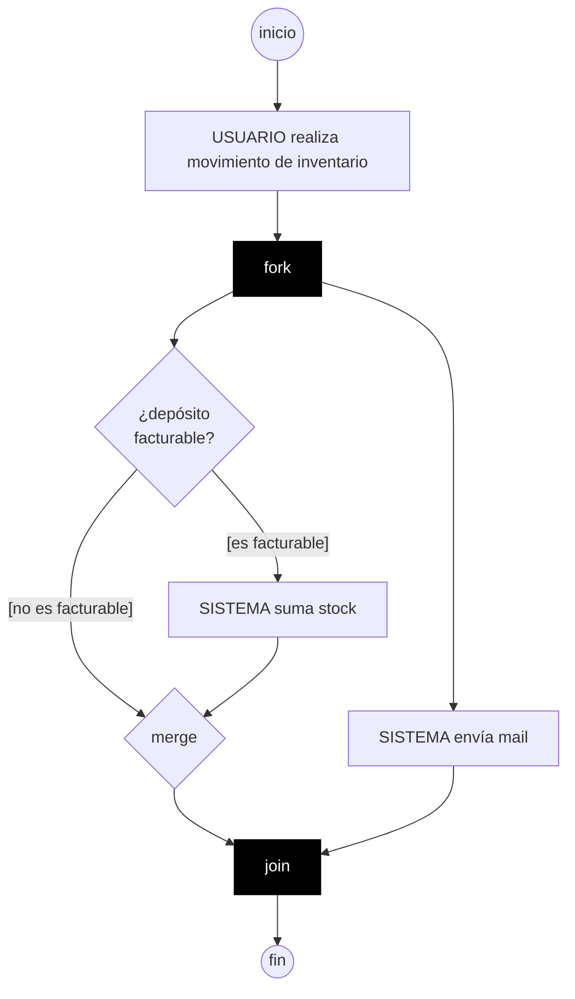

# 🔀 Diagramas de Actividades

> [!info] En contexto
> Es la **representación gráfica de la narrativa de un** [[Casos de Uso|caso de uso]] (con salvedades). Diagrama de **comportamiento** (dinámico).

## 1. Qué es y para qué sirve

- Muestra la **lógica** que ocurre como respuesta a acciones internas; los **pasos** para llevar a cabo una operación.
- Sirve para entender el **comportamiento de alto nivel** sin entrar en detalles internos.
- Parecido a un **diagrama de flujo**, pero su diferencia clave: **puede mostrar procesamiento PARALELO**.

> [!abstract] ¿Para qué resulta adecuado? (3 usos)
> 1. **Análisis de casos de uso** (entender qué acciones se necesitan y sus dependencias).
> 2. **Comprensión del flujo de trabajo** a través de varios casos de uso.
> 3. **Modelado de proceso de negocio (Workflow).**

> [!summary] Ventaja / Desventaja
> - ✅ **Ventaja:** soporta **comportamiento paralelo** (workflow, multi-thread).
> - ❌ **Desventaja:** NO muestra bien los enlaces entre **acciones y objetos** → para eso son mejores los [[Diagramas de Secuencia]].
> - Es de alto nivel y **NO tiene datos técnicos** → se puede **revisar con el usuario**.

## 2. Notación

| Elemento | Símbolo | Reglas (entradas / salidas) |
|---|---|---|
| **Inicio** | Círculo **relleno** ● | Solo **UNO** por diagrama. 1 salida. |
| **Actividad / Acción** | Caja de **extremos redondeados** | **1 entrada, 1 salida**. |
| **Fin** | Círculo relleno **dentro de otro** ◉ | Puede haber **varios**. 1 entrada. |
| **Transición** | **Flecha** | Indica el sentido del flujo. |
| **Bifurcación** (decisión) | **Rombo** ◇ | **1 entrada, 2 salidas**. Cada salida con su **guarda entre corchetes**. |
| **Unificación** (merge) | **Rombo** ◇ | Cierra la bifurcación: **2 entradas, 1 salida**. |
| **Fork** (división de control) | **Barra gruesa** ▬ | **1 entrada, varias salidas**. Inicia el **paralelo**. |
| **Join** (unión de control) | **Barra gruesa** ▬ | **Varias entradas, 1 salida**. Espera **TODAS** las entradas (sincroniza). |
| **Calles (swimlanes)** | Columnas con **líneas verticales** | Cada calle = **quién es responsable** de esas actividades. |

## 3. Reglas de construcción

> [!tip] Decisión vs. Paralelismo
> - **Bifurcación (rombo):** se ejecuta **UNA SOLA** rama (mutuamente excluyentes). Se cierra con **unificación**.
> - **Fork (barra):** todas las ramas se ejecutan **AL MISMO TIEMPO**. Se cierra con **join** (que espera a todas).
> - Usar **fork solo si el enunciado dice simultaneidad** ("al mismo tiempo que hago A, hago B").

- Las **calles** definen **quién hace qué** (Actor / Sistema).
- Se pueden **anidar** estructuras (ej.: una bifurcación dentro de un fork).
- Respecto a la narrativa del CU: el DA **NO incluye precondición ni poscondición**.

## 4. Ejemplo (gestión de stock)

> Usuario realiza un movimiento de inventario. **Al mismo tiempo** que verifica si el depósito es facturable (y, si lo es, suma stock), el sistema **envía un mail**.

> [!note] Mermaid vs UML
> Mermaid no tiene fork/join ni calles nativos: la barra negra simula el **fork/join** y los `{ }` simulan los **rombos**. En el parcial dibujá la notación **UML** (barras gruesas, rombos, calles).

## 5. Errores comunes ⭐⭐

> Ver consolidado en [[Checklist de Errores Comunes]].

- **Mezclar ramas de bifurcación hacia un join:** el join espera **todas** sus entradas, pero la bifurcación solo ejecuta **una** → **deadlock** (nunca llega al fin). ➡️ Cerrá la bifurcación con su **unificación** *antes* del join.
- **Actividad sin salida** → queda colgada. Toda actividad: 1 entrada + 1 salida.
- **No indicar quién** realiza la actividad → ponerlo en el nombre ("SISTEMA envía mail") o usar **calles**.
- **Bifurcación mal rotulada:** el rombo va **SIN texto adentro**, con las condiciones **afuera y entre corchetes**, y **NUNCA "sí/no"**.
- **Fork sin justificación** (la narrativa no dice "al mismo tiempo").
- **Faltan actores / no figura el sistema** → usar calles.

> [!cite] Fuente
> Apuntes UP *Introducción a Diagramas de Actividades*, PPT *Diagrama de Actividades* y *Ejemplo DA corregido*.
