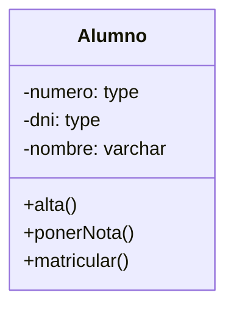
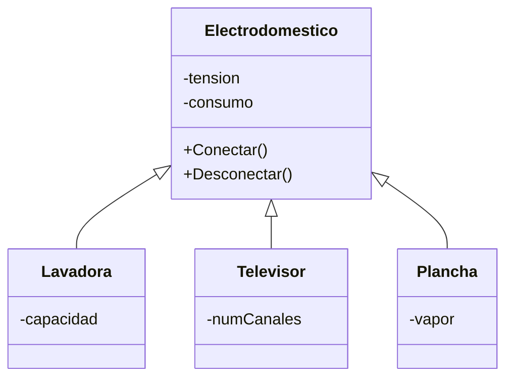

# 🏛️ Diagramas de Clases

> [!info] En contexto
> El **pilar básico de UML**. Diagrama de **estructura estática**. Las clases salen de los sustantivos del enunciado (ver [[Pensando en Objetos]]) y sus métodos se descubren con los mensajes de los [[Diagramas de Secuencia]].

## 1. Qué es

- **Diagramas de estructura estática**: muestran las clases y sus interrelaciones (herencia, agregación, asociación).
- Sirven para mostrar **qué hace** el sistema y **cómo se construye**.
- **Tipo: ESTRUCTURAL.**
- Una **clase** = agrupación de cosas; **plantilla** para armar objetos. Se detectan como **sustantivos en singular**.

## 2. Representación de una clase (3 secciones)

1. **Superior:** nombre de la clase.
2. **Media:** atributos.
3. **Inferior:** operaciones (métodos).

(Puede mostrarse esquemática: solo el rectángulo con el nombre.)

## 3. Visibilidad

| Símbolo | Visibilidad | Quién la usa |
|---|---|---|
| **+** | public | Cualquier clase externa con visibilidad hacia la clase. |
| **#** | protected | Descendientes o clases externas dentro del paquete. |
| **−** | private | Solo la propia clase. |

## 4. Atributos y métodos (sintaxis)

> [!example] Sintaxis textual UML
> - **Atributo:** `visibilidad nombre : tipo = valor inicial`
> - **Método:** `visibilidad nombre(parámetros) : tipo devuelto`

- **Atributos:** características propias → determinan el **estado** del objeto. Generalmente **tipos simples** (los compuestos se modelan como **relaciones**).
- **Métodos:** responsabilidades/comportamiento (generalmente **verbos**). Definen cómo se comunican las clases.

## 5. Cardinalidad / Multiplicidad

Se anota **en cada extremo** de la relación e indica grado/nivel de dependencia:

| Notación | Significado |
|---|---|
| `1` | uno |
| `1..*` (1..n) | uno o muchos |
| `0..*` (0..n) | cero o muchos |
| `m` | número fijo |

> [!example] Cómo se leen
> - `Cliente "1" -- "1..*" OrdenDeCompra`: un cliente tiene muchas órdenes; una orden tiene **un solo** cliente.
> - `Paciente "0..*" -- "1..*" Doctor`: un paciente es atendido por muchos doctores y un doctor atiende a muchos pacientes.

> [!note] Clases vs Objetos
> | CLASES | OBJETOS |
> |---|---|
> | Atributos | Estado |
> | Métodos | Comportamiento |
> | **Cardinalidad** | **Multiplicidad** |

## 6. Relaciones

- **Asociación:** línea que une dos clases; objetos que **colaboran**. **NO es fuerte**: el tiempo de vida de un objeto **no depende** del otro. (Ej.: `Auto — Motor`.)
- **Agregación:** nombrada como tipo de relación (el material **no** desarrolla la diferencia gráfica rombo vacío vs lleno).
- **Generalización / Herencia:** **triángulo** del lado de la clase **padre** (más general). Clase abstracta → nombre en **itálica**.
  - **Generalización:** mirar de **hijo → padre**.
  - **Especialización:** mirar de **padre → hijo**.

> [!tip] Tipos de herencia (Liskov)
> - **Herencia de tipo:** responde a **"¿es un?"**. Ej.: `Moto es un Vehículo`.
> - **Herencia de uso:** **NO** responde a "¿es un?"; se usa para reutilizar código. Ej.: `Silla` hereda de `Mesa`.
>
> ⚠️ La **herencia rompe el encapsulamiento** (Snyder): el hijo accede a atributos e implementación del padre.

> [!note] No desarrollados en el material
> Composición (rombo lleno), clase asociación, dependencia y realización/interfaz **no** se desarrollan en estos apuntes.

## 7. Cómo identificar clases (método de Rumbaugh — 9 pasos)

1. **Identificar clases** de objetos (sustantivos; evitar estructuras de implementación; no preocuparse aún por herencia).
2. **Retener clases candidatas** (descartar **redundantes**, **irrelevantes**; una operación con características propias → clase).
3. **Diccionario de datos** (describir cada clase).
4. **Identificar asociaciones** (no perder tiempo distinguiendo asociación vs. agregación).
5. **Retener asociaciones correctas** (eliminar las de clases borradas, irrelevantes, **acciones/sucesos transitorios**, ternarias, derivadas).
6. **Identificar atributos** (propiedades de objetos individuales; nombre significativo; no exagerar).
7. **Retener atributos correctos** (si importa la **existencia independiente** → es objeto, no atributo).
8. **Refinamiento mediante herencia** (generalizar lo común / especializar).
9. **Iteración** del modelo (si hay error, volver a la etapa anterior).

## 8. Errores comunes (ejemplo corregido) ⭐⭐

> Del sistema de seguridad vial. Ver [[Checklist de Errores Comunes]].

- ❌ **Clase "Sistema" / "ProcesadorMultas" que hace todo** (antipatrón *clase Dios*). **El sistema NO es una clase.** Hay que **repartir responsabilidades** entre las clases del dominio.
- ❌ **Inventar clases ajenas al dominio** (ej.: `Usuario` con login si el enunciado no lo pide).
- ❌ **Olvidar clases del dominio** (Cámara, Infracción, Foto…).
- ❌ **Olvidar atributos relevantes** (velocidad máxima, datos del vehículo, ubicación del radar).
- ❌ **Olvidar relaciones necesarias** (ej.: relacionar Radar con Multa).

> [!cite] Fuente
> PPTs UP *Introducción a Diagramas de Clases* y *Diagramas de Clases*, y *Ejemplo DC corregido*. (En el material "Rumbaught" = **Rumbaugh**.)
