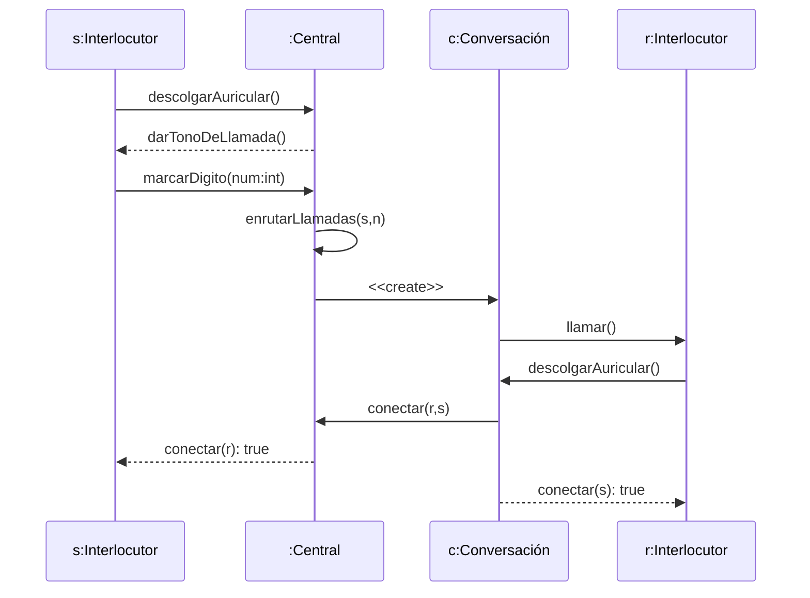
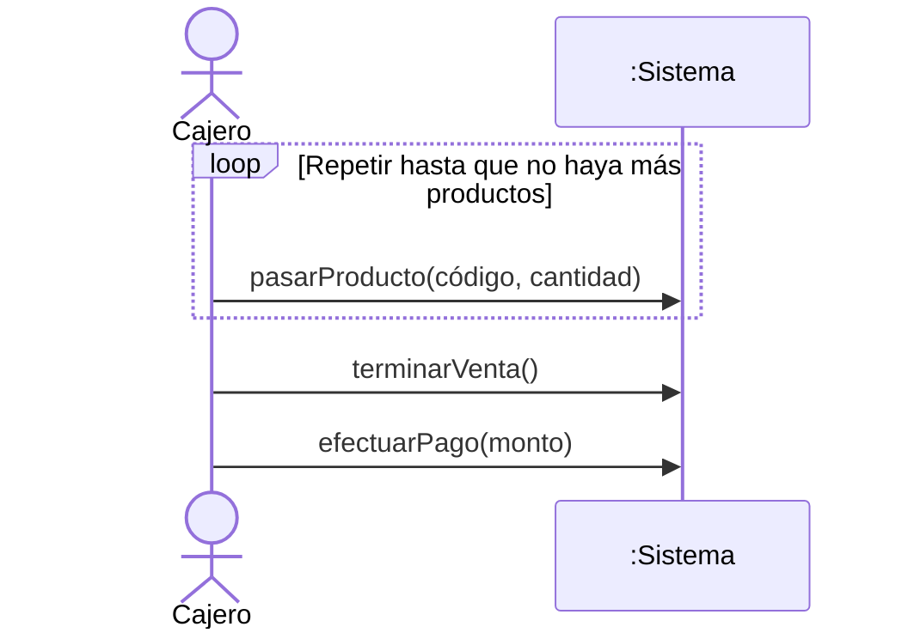

# ⏱️ Diagramas de Secuencia

> [!info] En contexto
> Modela la **interacción entre objetos en el tiempo**. **Realiza un escenario de un** [[Casos de Uso|caso de uso]]. Sus mensajes se transforman en los **métodos** de las [[Diagramas de Clases|clases]]. Diagrama de **comportamiento** (dinámico).

## 1. Qué es

- Modela los **aspectos dinámicos**: interacciones entre objetos **organizadas en secuencia temporal**.
- Muestra los **objetos participantes** y la **secuencia de mensajes**.

> [!abstract] Dos dimensiones
> - **Vertical → TIEMPO** (de arriba hacia abajo).
> - **Horizontal → OBJETOS** que participan.

> [!tip] Relación con casos de uso
> Su creación **depende de los casos de uso**. Muestra, para un **escenario** de un CU: los eventos de los **actores externos**, su **orden** y los **eventos internos** del sistema.

## 2. Notación

| Elemento | Cómo se dibuja |
|---|---|
| **Rol / objeto** | Rectángulo con etiqueta **`nombreRol : Clase`** (¡con los dos puntos!). |
| **Línea de vida** (lifeline) | Línea **vertical punteada** que sale del objeto → su tiempo de existencia. |
| **Activación / foco de control** | **Rectángulo delgado** sobre la línea de vida → tiempo de ejecución de una acción. |
| **Mensaje** | **Línea horizontal** entre líneas de vida; puede llevar parámetros y retorno. |
| **Mensaje síncrono** | Flecha **llena** (`marcarDigito(num:int)`). |
| **Mensaje de retorno** | Flecha **punteada** con el valor devuelto. |
| **Auto-mensaje** (self-call) | Flecha que sale y vuelve al mismo objeto (`enrutarLlamadas(s,n)`). |
| **Creación** | Estereotipo **`<<create>>`** (el objeto aparece más abajo, a su altura temporal). |
| **Destrucción** | **X** al final de la línea de vida + **`<<destroy>>`**. |
| **Actor** | Genera los eventos iniciales. |

> [!important] El mensaje es un método
> Un **mensaje invoca una operación (método)** del objeto receptor. Los mensajes que recibe un objeto **se transforman en los métodos de su clase** → el DS ayuda a **descubrir las operaciones** de cada clase.

## 3. Fragmentos combinados (PPT "Implementaciones")

Cada **estructura de control del código** se traduce a un **marco** con guarda **entre corchetes**:

| Código | Fragmento | Cómo |
|---|---|---|
| `if` | **ALT** | Bloque `ALT [condición]`. |
| `if-else` | **ALT dividido** | Mismo bloque, separado por **línea punteada**; el `else` va **debajo**. |
| `switch` | **varios ALT** | Un bloque `ALT [x==caso]` por cada *case*. |
| `for` / `while` / `do-while` / `for-each` | **FOR** (loop) | Bloque `FOR [condición]`. |
| anidados (`for-if`) | **anidados** | Un marco **dentro** de otro. |

## 4. Ejemplos

> [!note] Mermaid vs UML
> En el material la leyenda es **`ALT`** (para `if`/`if-else`/`switch`) y **`FOR`** (para bucles). En Mermaid se escriben `alt`/`else` y `loop`.

## 5. Errores comunes (ejemplo corregido) ⭐⭐

> Del sistema de seguridad vial. Ver [[Checklist de Errores Comunes]].

- **Falta un `loop`** tras una búsqueda. *"Es como tener papeles en una caja: si buscás uno, tenés que mirar uno por uno."* Una búsqueda que recorre elementos = **iteración**, no un único mensaje.
- **Nombres de clases sin los dos puntos** → la sintaxis correcta es `nombre:Clase` o `:Clase`.
- **El sistema no puede ser actor ni clase** → repartir sus responsabilidades entre clases concretas (Radar, Cámara, etc.).

> [!cite] Fuente
> PPTs UP *Introducción a Diagramas de Secuencia* e *Implementaciones*, y *Ejemplo DS corregido*.
