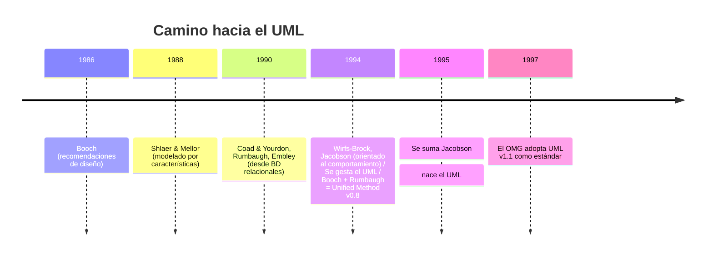

# 📐 Introducción a UML

> [!info] En contexto
> Después de [[Pensando en Objetos]], UML es el **lenguaje** con el que vamos a expresar los modelos. De acá salen las herramientas: [[Casos de Uso]], [[Diagramas de Clases]], [[Diagramas de Secuencia]], [[Diagramas de Actividades]].

## 1. Qué es UML (definición central)

> [!quote] Definición
> **UML = Unified Modeling Language** (Lenguaje Unificado de Modelado). Es un **lenguaje de propósito general para el modelado orientado a objetos**, impulsado por el **OMG (Object Management Group)**.

**UML combina notaciones provenientes de:**
- Modelado Orientado a Objetos
- Modelado de Datos
- Modelado de Componentes
- Modelado de Flujos de Trabajo (Workflows)

## 2. Método vs. Lenguaje de modelado ⭐

> [!warning] Distinción clave de parcial
> **UML es un LENGUAJE de modelado, NO un método.**

| | Definición |
|---|---|
| **Método** | "Descripción de los **pasos** a seguir, indicando el **orden**, las técnicas y herramientas a emplear en cada paso, para lograr un objetivo." Un conjunto de técnicas, herramientas y tareas. |
| **Lenguaje** | Conjunto de señales que dan a entender una cosa. Posee **elementos** y **reglas sintácticas** para combinarlos. |
| **Lenguaje de modelado** | Se emplea para **expresar ideas por medio de modelos**. |

## 3. Concepto de modelo

> [!quote] Qué es un modelo
> "Un modelo es el **cuerpo de información** recabado acerca de un sistema con el fin de estudiarlo."

- Se requiere un modelo cuando **no se puede estudiar el sistema en sí** (por complejidad, tamaño, costo, inexistencia, etc.).
- **El modelo NO es el sistema** → tiene, necesariamente, **diferencias** con él.
- A veces hace falta un **conjunto de modelos** para enfocar el sistema desde **distintas perspectivas** y **disminuir la brecha** modelo ↔ sistema.

## 4. Objetivos del UML

1. Establecer un **lenguaje visual** de modelado, expresivo y sencillo.
2. Mantener **independencia** de los procesos de modelado y de los lenguajes de programación.
3. Establecer **bases formales**.
4. Integrar las **mejores prácticas**.
5. Imponer un **estándar mundial**.

## 5. Historia y evolución (fechas para memorizar)

> [!example] Evolución de los enfoques de análisis
> - **Orientación a procesos** (~'50–'90): qué debe hacer el sistema, sin importar el almacenamiento. Declina con las **bases de datos comerciales**.
> - **Orientación a datos** (~'70): nace con el **modelo relacional**. El más difundido.
> - **Orientación a objetos** (Smalltalk, **1969**): se habla de **diseño OO** a inicios de los '80 y de **análisis OO** a fines de esa década.

**Los "tres amigos":** **Booch, Rumbaugh y Jacobson**.

**Camino a la estandarización:**
- 1994: Booch plantea unificar criterios; se le une **Rumbaugh** (oct.) → *Unified Method v0.8*.
- 1995: se suma **Jacobson** → **nace el UML**.
- Se elaboran v0.9, v0.91, v1.0 (1996), v1.1 → presentada al **OMG**.
- **Fines de 1997: el OMG adopta UML v1.1 como estándar.**

## 6. Por qué UML predomina

- Participación de **metodólogos influyentes**.
- Participación de **importantes empresas**.
- **Estándar del OMG**.

## 🔑 Vocabulario

UML · OMG · método vs. lenguaje · lenguaje de modelado · modelo · abstracción · paradigma · orientación a procesos/datos/objetos · Smalltalk · modelo relacional · los tres amigos (Booch, Rumbaugh, Jacobson) · Unified Method · estándar mundial.

> [!note] Nota de fidelidad
> El apunte de la cátedra llega hasta "modelo de análisis y diseño" y **no enumera** los tipos de diagramas UML. Para la taxonomía de diagramas ver el [[Análisis de Sistemas - Índice#🧭 Clasificación de diagramas UML referencia rápida|índice]].
