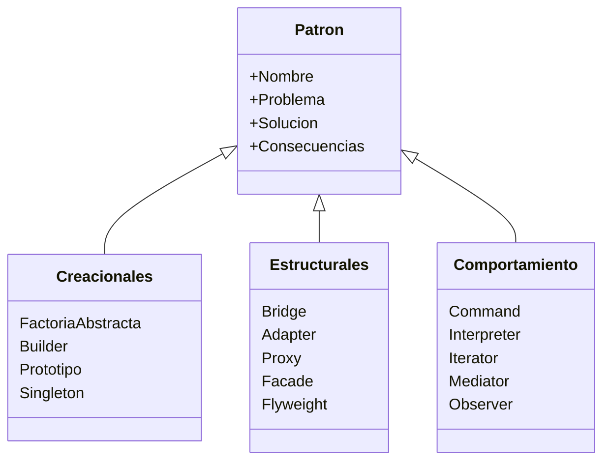
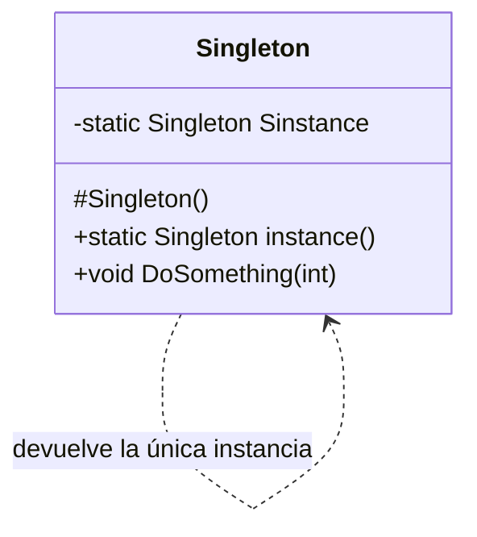

# ♟️ Patrones de Diseño

> [!info] En contexto
> Soluciones probadas a problemas de diseño recurrentes. Se aplican sobre el modelo de [[Diagramas de Clases|clases]] y dentro de una [[Arquitectura de Software|arquitectura]].

## 1. Qué es un patrón

> [!quote] Definición y propósito
> Un **patrón es una solución para un problema en un contexto**. Su propósito es la **reutilización eficiente**.

Los **patrones de software** son formas **"estandarizadas"** de resolver problemas comunes de diseño. Sirven para **identificar problemas típicos y sus soluciones**.

> [!summary] Ventajas
> - Amplio **catálogo** de problemas y soluciones.
> - **Estandarizan** la resolución.
> - **Condensan y simplifican** el aprendizaje de buenas prácticas.
> - Dan un **vocabulario común** entre desarrolladores.
> - Evitan **"reinventar la rueda"**.

## 2. Elementos de un patrón

1. **Nombre** — identifica el patrón (de las partes más difíciles).
2. **Problema** — cuándo utilizarlo.
3. **Solución** — qué se obtiene al aplicarlo.
4. **Consecuencias** — ventajas y desventajas.

## 3. Clasificación ⭐



| Clase | Para qué | Patrones que nombra |
|---|---|---|
| **Creacionales** | Cómo **crear** objetos (problema de la instanciación; delegar/encapsular la creación) | Factoría abstracta, Builder, Prototipo, **Singleton** |
| **Estructurales** | Cómo **agrupar y organizar** objetos (interconexiones en ejecución) | Bridge, Adapter, Proxy, Facade, Flyweight |
| **De comportamiento** | Cómo se **relacionan en ejecución** (dimensión temporal; llamadas entre objetos) | Command, Interpreter, Iterator, Mediator, Observer |

## 4. Patrón desarrollado: Singleton

> [!quote] Idea
> "En la implementación de un patrón Singleton **solo puede haber una instancia**."



```cpp
class Singleton {
public:
    static Singleton * instance(void);
    void DoSomething(int);
protected:
    Singleton();              // constructor NO público
private:
    static Singleton * Sinstance;  // única instancia
};
```

Claves: constructor **`protected`**, acceso vía método estático **`instance()`**, instancia única en atributo estático privado **`Sinstance`**.

> [!note] Nota de fidelidad
> El PPT **no menciona** explícitamente a **GoF / Gang of Four** ni al libro *Design Patterns*, aunque los patrones que lista son los clásicos de ese catálogo. **Singleton** es el único desarrollado con código.

> [!cite] Fuente
> PPT UP *Introducción a los patrones de diseño*.
