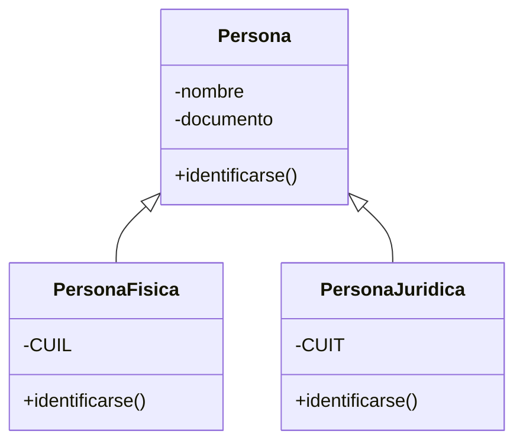

# 🧱 Pensando en Objetos (POO)

> [!info] En contexto
> Base conceptual de toda la materia. Antes de modelar con [[Introducción a UML|UML]] hay que pensar el mundo en términos de **objetos**. Tema siguiente: [[Introducción a UML]].

## 1. Clase y objeto

> [!quote] Definiciones (Pressman)
> **Clase:** "Una clase es una descripción generalizada (por ejemplo, una plantilla o plano) de una colección de objetos similares. Contiene **nombre, atributos y métodos**."
>
> **Objeto:** "Los objetos son **instancias** de una clase específica y heredan sus atributos y las operaciones que están disponibles para manipular esos atributos."

- Una clase contiene tres cosas: **nombre, atributos y métodos**.
- Un objeto es una **instancia** de una clase.

**Ejemplo del apunte:**
- Clase **persona** → atributos: `nombre, documento, dirección, teléfono` → métodos: `trabajar, comer, comunicarse, identificarse`.
- A partir de ella se **instancia** el objeto `juan`.

## 2. Clasificación (de enunciado a clases)

> [!tip] Regla mnemotécnica — ¡cae siempre!
> - **Sustantivos → clases**
> - **Verbos → métodos**
> - **Adjetivos → atributos**

- Las clases se **agrupan por funcionalidad** formando **jerarquías**.
- No solo se identifican clases, **también las relaciones** entre ellas.
- Para lograr **separación de responsabilidades** se usan **simulaciones de situaciones reales**.
- Deben quedar claros los **patrones jerárquicos** y el **flujo de mensajes**.

## 3. Encapsulamiento y ocultamiento de información

> [!quote] Definición
> "Consiste en **ocultar el estado** de los datos de un objeto, de modo que solo puedan ser cambiados a través de las **operaciones definidas** para tal fin."

**Niveles de acceso a la información:**

| Acceso | Quién la necesita |
|---|---|
| **Privada** | Solo el objeto, para operar. Innecesaria para los demás. |
| **Pública** | El resto de los objetos, para interactuar con el objeto. |
| **Protegida** | Las clases heredadas. |

**Ejemplo:** la clase `persona` tiene el atributo `edad`, que **no se accede directamente**: se declara **privado** y se crean dos métodos (uno para *ingresar* y otro para *obtener* la edad) → así se **encapsula** el atributo (idea de setter/getter).

## 4. Retención de estado

> [!quote] Definición
> "La información de un objeto se mantiene en el mismo estado **hasta que sea alterado** por las operaciones definidas para tal fin."

## 5. Herencia

> [!quote] Definición (Pressman)
> "Una **subclase Y** hereda todos los atributos y operaciones de su **superclase X**. Todas las estructuras de datos y algoritmos de X están disponibles de inmediato para Y; no se necesita hacer más trabajo."

- Terminología: **subclase (Y)** / **superclase (X)**.

## 6. Polimorfismo

> [!quote] Definición
> "Capacidad de una clase de **comportarse de diferentes maneras** según el estímulo recibido. Se da mediante **sobrecarga** o **sobreescritura**."

| Mecanismo | Firma del método | Comportamiento |
|---|---|---|
| **Sobrecarga** | **Se modifica** la firma | Se **mantiene** |
| **Sobreescritura** (override) | **Se mantiene** la firma | Es **diferente** |

## 7. Generalización

> [!quote] Definición
> "Caso particular de herencia que consiste en la relación entre una **clase general** y sus **clases hijas especializadas**."

- Ejemplo 1: clase general `animal` y específicas `humano, perro, etc.`
- Ejemplo 2: de `persona` se baja el detalle a **Persona Física** (atributo `CUIL`) y **Persona Jurídica** (atributo `CUIT`). Ambas **sobreescriben** `identificarse()` (una devuelve CUIL y la otra CUIT) → conecta **generalización + polimorfismo**.

## 🔑 Vocabulario para memorizar

clase · objeto · instancia · atributo · método · mensaje · flujo de mensajes · jerarquía · encapsulamiento · ocultamiento de información · privada/pública/protegida · retención de estado · herencia · subclase/superclase · polimorfismo · sobrecarga · sobreescritura · firma del método · generalización · responsabilidades.

> [!cite] Fuente
> Apunte de cátedra UP *Pensando en Objetos*. Referencias citadas: Pressman, *Ingeniería del software*.
