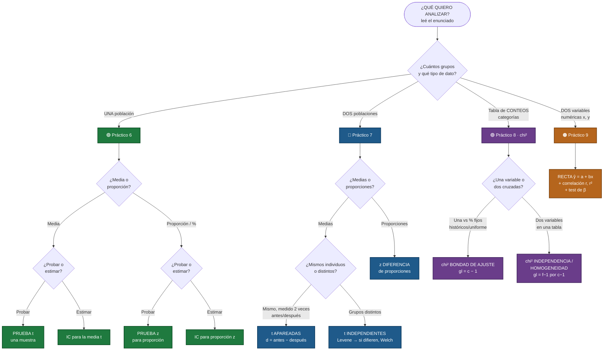
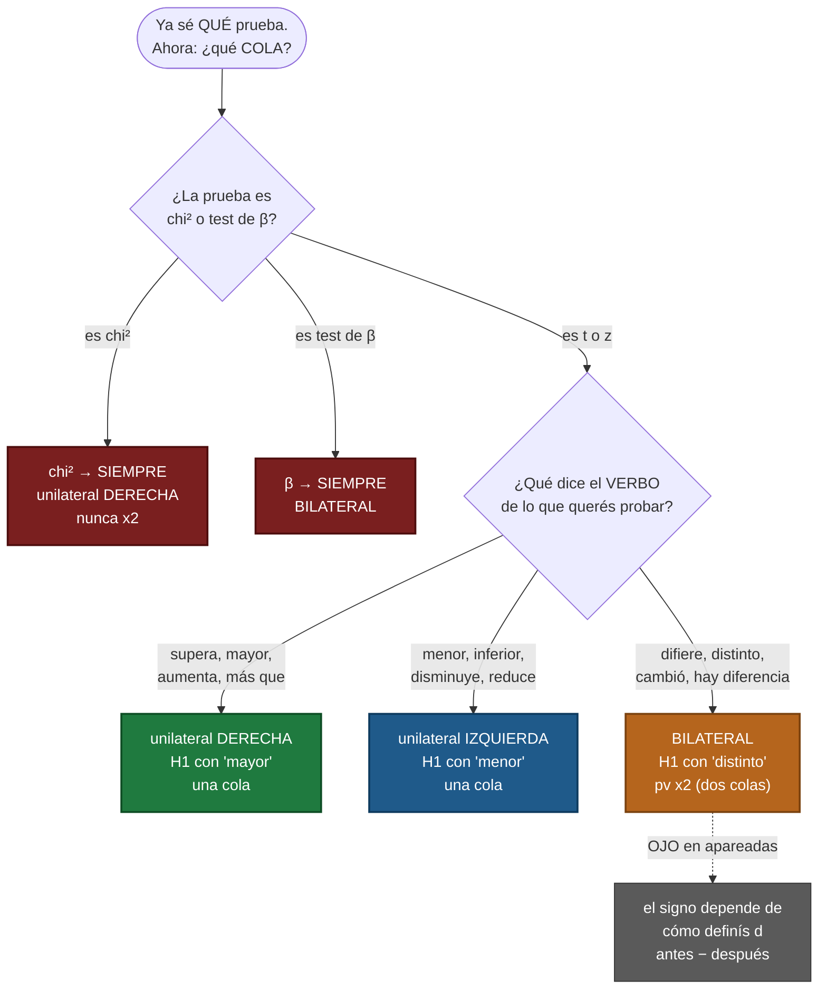

---
tags:
  - probabilidad-estadistica
  - 2do-parcial
  - arbol-decision
  - chuleta
tema: Árbol de decisión — qué prueba uso (hoja única de consulta rápida)
materia: Probabilidad y Estadística
parcial: 2
aliases:
  - Árbol de decisión
  - Qué prueba uso
  - Chuleta
---

# 🌳 Árbol de decisión — ¿qué prueba uso?

> [!abstract] Para mirar MIENTRAS resolvés
> Hoja única, sin teoría. Leés el enunciado, bajás por el árbol y sacás la prueba. Después el **verbo** te da la cola, y la última tabla te dice si va por **jamovi** o **a mano**.
>
> **Orden de la página:** 1) las 3 preguntas · 2) el árbol (qué prueba) · 3) palabras clave · 4) la cola (uni/bilateral) · 5) un ejemplo por cada final · 6) jamovi o a mano · 7) el cierre.

---

## 1️⃣ Las 3 preguntas (hacelas SIEMPRE, en orden)

> [!question] Antes de tocar nada
> 1. **¿Cuántos grupos?** → uno · dos · (categorías/tabla) · (dos variables numéricas)
> 2. **¿Qué tipo de dato?** → media (números que se promedian) · proporción (% de éxitos) · categorías (conteos)
> 3. **¿Probar o estimar?** → "¿hay evidencia / supera / difiere?" = **PH** · "estimar / intervalo / con X% de confianza" = **IC** (no hay $H_0$)

---

## 2️⃣ El árbol — ¿qué prueba? (diagrama)

> [!tip] Cómo leerlo
> Arrancá arriba en **"¿Qué quiero analizar?"** y seguí las flechas respondiendo cada rombo. Cada **color** es un práctico distinto. La caja final (oscura) es **la prueba que tenés que usar**.



> [!note]- 📄 El mismo árbol en versión texto (por si el diagrama no carga)
> El diagrama se ve **solo en modo Lectura** (📖 / `Ctrl+E`). Si no carga, acá está igual:
> ```
> ¿Qué quiero analizar?
> │
> ├── UNA población  → Práctico 6
> │   ├── Media (cuantitativa, σ desconocido) ............. PRUEBA t DE UNA MUESTRA
> │   └── Proporción / % de éxitos ........................ PRUEBA z PARA PROPORCIÓN
> │
> ├── DOS poblaciones → Práctico 7
> │   ├── Medias, DOS grupos DISTINTOS .................... t MUESTRAS INDEPENDIENTES
> │   │      (primero Levene; si varianzas ≠ → Welch)
> │   ├── Medias, MISMO individuo medido 2 veces .......... t MUESTRAS APAREADAS
> │   │      (antes/después, pre-post, test-retest)
> │   └── Proporciones de dos grupos ..................... z DIFERENCIA DE PROPORCIONES
> │
> ├── CATEGÓRICOS / conteos en tabla → Práctico 8 (χ²)
> │   ├── ¿Sigue proporciones dadas/históricas/uniforme? .. χ² BONDAD DE AJUSTE
> │   ├── ¿Dos variables independientes? (1 muestra, 2 var) χ² INDEPENDENCIA
> │   └── ¿Misma variable igual en k poblaciones? ......... χ² HOMOGENEIDAD
> │       (independencia y homogeneidad → mismo botón en jamovi)
> │
> └── RELACIÓN entre 2 variables CUANTITATIVAS → Práctico 9
>     └── Recta ŷ=a+bx + correlación (r, r²) + test de β
> ```

---

## 3️⃣ Palabras clave que delatan la prueba

> [!tip] Si el enunciado dice…
> - **"antes y después / pre-post / el mismo grupo"** → t **apareadas**
> - **"dos sucursales / hombres vs mujeres / dos sistemas"** (individuos distintos) → t **independientes**
> - **"porcentaje / proporción / % de…"** → una: z proporción · dos: z diferencia de proporciones
> - **"¿depende de? / ¿está relacionado? / ¿es independiente?"** + tabla → χ² **independencia**
> - **"¿se mantienen las proporciones históricas? / ¿es uniforme? / ¿sigue tal distribución?"** → χ² **bondad de ajuste**
> - **"¿diferencias según línea/proveedor/rubro?"** + tabla → χ² **homogeneidad**
> - **"estimar y en función de x / recta / asociación lineal"** → regresión
> - **"estimar / intervalo / con un X% de confianza"** → es un **IC**, no una PH

---

## 4️⃣ La cola — ¿uni o bilateral? (segundo diagrama)

> [!important] El árbol de arriba decide la PRUEBA. Este decide la DIRECCIÓN.
> Son dos pasos separados: primero el árbol te da *qué* prueba (t, z, χ²…), y **después** este diagrama te da la cola. La cola la manda el **verbo de lo que querés probar** ($H_1$).

> [!danger] ⚠️ Esto SOLO aplica a pruebas de hipótesis (PH), NO a los IC
> La cola **solo existe si hay $H_1$**. En un **intervalo de confianza no hay hipótesis** → **no hay cola**, no te preguntes uni/bilateral. Mirá la pregunta 3 del árbol:
> - *"¿hay evidencia / supera / difiere?"* → **PH** → SÍ usás este diagrama.
> - *"estimar / intervalo / con X% de confianza"* → **IC** → **NO** aplica (solo calculás centro ± EM).
>
> Tampoco aplica a "interpretar coeficientes" ni a la teoría de errores: la cola es **solo para PH**.



> [!warning] La tabla rápida (el verbo → el signo de $H_1$)
> | Verbo del enunciado | Signo $H_1$ | Cola |
> |---|---|---|
> | supera / mayor / aumenta / más que | `>` | derecha |
> | inferior / menor / disminuye / reduce | `<` | izquierda |
> | difiere / distinto / cambió / hay diferencia | `≠` | **bilateral (pv ×2)** |
> |---|---|---|
> | **χ²** (bondad / indep. / homog.) | — | **siempre derecha** (no elegís) |
> | **test de β** (regresión) | — | **siempre bilateral** (no elegís) |

> [!question] ¿Qué cambia, en la práctica, que sea para un lado o para el otro?
> La dirección afecta **3 cosas concretas** (y nada más):
> 1. **El símbolo de $H_1$:** `>` (derecha) · `<` (izquierda) · `≠` (bilateral).
> 2. **El p-valor:** unilateral = una cola · **bilateral = esa cola ×2**. → con el mismo dato, el bilateral da un pv **más grande**, así que es **más difícil** rechazar (te exige más evidencia).
> 3. **Qué podés concluir:** si rechazás un `>` concluís *"es **mayor**"*; un `<` → *"es **menor**"*; un `≠` → solo *"es **distinto**"* (sin decir hacia qué lado).
>
> **La intuición:** unilateral = *"sospecho que subió"* → apostás a un lado y sos más sensible ahí. Bilateral = *"sospecho que cambió, pero no sé para dónde"* → repartís la atención a los dos lados, y por eso pagás el **×2**.
>
> 💡 **En el parcial, lo más concreto que cambia es: ¿multiplico el p-valor por 2 o no?** → Bilateral (`≠`) sí · Unilateral (`>`, `<`) no. Todo lo demás (la prueba, la cuenta del estadístico, el α) es **idéntico**.

> [!tip] Por qué el bilateral se multiplica por 2
> - **Unilateral** = tu afirmación apunta a **un lado** → mirás **una sola cola** de la curva.
> - **Bilateral** = "son distintos" puede caer en **cualquiera de los dos extremos** → mirás **las dos colas** → por eso $pv = 2\times(\text{una cola})$.
> - Imagen mental: unilateral = *"¿se fue para la derecha?"* · bilateral = *"¿se fue lejos, para algún lado?"*

> [!warning] Los 3 casos que NO elegís
> - **χ²** → siempre **derecha** ($pv=P(\chi^2>\chi^2_m)$, nunca ×2). El estadístico solo es positivo y "diferencia grande" está a la derecha.
> - **test de β** → siempre **bilateral** ("¿hay asociación?" no tiene dirección: la pendiente puede ser + o −).
> - **apareadas** → el signo depende de cómo definas $d$ (ver [[02 - Práctico 7 - Comparación de dos muestras|P7]]): "redujo" es `>` si $d=$ antes−después, o `<` si es al revés.

### El flujo completo (los 4 pasos juntos)

```
1. ÁRBOL  → ¿qué prueba?           (cuántos grupos + tipo de dato)
2. VERBO  → ¿qué signo tiene H1?   (supera = >  ·  menor = <  ·  difiere = ≠)
3. COLA   → unilateral (1 lado) o bilateral (×2)
            • χ² → siempre derecha
            • β  → siempre bilateral
            • apareadas → depende de cómo definiste d
4. pv vs α → pv < α ⇒ Rechazo H0
```

---

## 5️⃣ Un enunciado de ejemplo por CADA final del árbol

> [!abstract] Cómo leer esta sección
> Para cada hoja del árbol tenés: **el enunciado** → **la prueba** (a dónde llegaste) → **$H_0$ / $H_1$ con la cola** → **por qué esa cola**. Así ves el camino completo, del cuento a la dirección.

### 🟢 Práctico 6 — Una población

> [!example] t una muestra (media) — UNILATERAL DERECHA
> *"Una fábrica dice que sus drones vuelan en promedio **más de 28 min**. Se miden 15 drones. ¿Hay evidencia?"*
> - Camino: **1 grupo → media → probar** → **t una muestra**.
> - $H_0:\mu\le28$ · $H_1:\mu>28$ → **derecha** (el verbo "más de" apunta hacia arriba).

> [!example] t una muestra (media) — UNILATERAL IZQUIERDA
> *"Un proveedor promete un tiempo medio de entrega **menor a 48 h**. Se miden 20 entregas. ¿Los datos lo respaldan?"*
> - Camino: **1 grupo → media → probar** → **t una muestra** (misma prueba que el de drones, ¡distinta cola!).
> - $H_0:\mu\ge48$ · $H_1:\mu<48$ → **izquierda** (el verbo "menor a" apunta hacia abajo).

> [!example] z una proporción — UNILATERAL DERECHA
> *"De 240 visitas, 86 abandonaron el carrito. ¿La tasa **supera el 30%**?"*
> - Camino: **1 grupo → proporción → probar** → **z proporción**.
> - $H_0:p\le0{,}30$ · $H_1:p>0{,}30$ → **derecha** ("supera").

> [!example] IC media — SIN COLA
> *"Con 18 mediciones, **estimá con 95% de confianza** el tiempo medio de respuesta."*
> - Camino: **1 grupo → media → estimar** → **IC media**.
> - **No hay $H_1$ → no hay cola.** Solo: centro $\pm EM$.

> [!example] IC proporción — SIN COLA
> *"De 150 clientes, 117 satisfechos. **IC del 90%** para la proporción satisfecha."*
> - Camino: **1 grupo → proporción → estimar** → **IC proporción**.
> - **Sin cola** (es estimación, no PH).

### 🔵 Práctico 7 — Dos poblaciones

> [!example] t apareadas — la cola depende de cómo definís d
> *"A las **mismas 8 plantas** se mide la ausencia antes y después. ¿El plan **redujo** las ausencias?"*
> - Camino: **2 grupos → medias → mismo individuo 2 veces** → **t apareadas**.
> - Definís $d=\text{antes}-\text{después}$ → reducir = antes > después = $d>0$.
> - $H_0:\mu_d\le0$ · $H_1:\mu_d>0$ → **derecha** (¡"redujo" salió `>` por el orden de la resta!).

> [!example] t independientes — BILATERAL
> *"Baterías del Proveedor A (12) y B (14). ¿**Difiere** la autonomía media?"*
> - Camino: **2 grupos → medias → grupos distintos** → **t independientes** (+Levene).
> - $H_0:\mu_A=\mu_B$ · $H_1:\mu_A\ne\mu_B$ → **bilateral** ("difiere", sin dirección → ×2).

> [!example] z diferencia de proporciones — BILATERAL
> *"Ingeniería: 54 de 120. Económicas: 54% de 200. ¿**Difieren** los porcentajes?"*
> - Camino: **2 grupos → proporciones** → **z diferencia de proporciones**.
> - $H_0:p_I=p_E$ · $H_1:p_I\ne p_E$ → **bilateral** ("difieren" → ×2).

### 🟣 Práctico 8 — Chi-cuadrado (cola SIEMPRE derecha, no elegís)

> [!example] χ² bondad de ajuste — DERECHA (fija)
> *"Las cajas vienen en 4 colores con proporciones 40/30/20/10%. En 300 cajas, ¿se **mantienen** las proporciones históricas?"*
> - Camino: **tabla de conteos → 1 variable vs % fijos** → **χ² bondad de ajuste** ($\nu=c-1=3$).
> - $H_0$: sigue 40/30/20/10 · $H_1$: no las sigue → **derecha fija** ($pv=P(\chi^2>\chi^2_m)$, nunca ×2).

> [!example] χ² independencia/homogeneidad — DERECHA (fija)
> *"Tabla cruzando plan contratado × grupo de edad (400 usuarios). ¿El plan **depende de** la edad?"*
> - Camino: **tabla de conteos → 2 variables cruzadas** → **χ² independencia** ($\nu=(f-1)(c-1)$).
> - $H_0$: independientes · $H_1$: depende → **derecha fija** (no se multiplica ×2).

### 🟠 Práctico 9 — Regresión (test de β SIEMPRE bilateral, no elegís)

> [!example] regresión / test de β — BILATERAL (fija)
> *"Horas de estudio (x) y nota (y) de 12 alumnos, recta dada. ¿**Hay asociación lineal**?"*
> - Camino: **2 variables numéricas** → **regresión → test de β**.
> - $H_0:\beta=0$ (sin relación) · $H_1:\beta\ne0$ (hay relación) → **bilateral fija** ($\nu=n-2$).

> [!quote] La idea que cierra todo
> Fijate el patrón: en t y z **el verbo decide** la cola (`>`, `<`, `≠`). En **χ²** es siempre derecha y en **β** siempre bilateral (no elegís). Y en los **IC no hay cola** porque no hay hipótesis.

---

## 6️⃣ Ya sé la prueba: ¿jamovi o a mano? ¿está la fórmula?

> [!info] Regla madre
> **Datos crudos** (lista de números/tabla) → **jamovi**. **Datos resumidos** ($\bar x,s,n$ / coef. / un estadístico ya dado) → **a mano**.

| Prueba | Ruta jamovi | ¿Fórmula en la hoja? |
|---|---|---|
| t una muestra | Pruebas t → Una muestra | ✅ sí |
| t independientes | Pruebas t → Independientes (Levene) | ❌ (suele ir con datos→jamovi) |
| t apareadas | Pruebas t → Pareadas | ❌ (suele ir con datos→jamovi) |
| z una proporción | a mano + distrACTION (Normal) | ✅ sí |
| z dos proporciones | Recuento → indep. → "comparing proportions" | ❌ **memorizar** |
| χ² (bondad / indep.) | Recuento → N Resultados / Indep. (Counts) | ❌ **memorizar** |
| Regresión / test β | Regresión → Linear Regression | ❌ **memorizar** |
| IC media / proporción | de la misma prueba t / a mano | ✅ sí |

---

## 7️⃣ Y siempre, el cierre

$$\boxed{\ p\text{-valor} < \alpha \ \Rightarrow\ \text{Rechazo } H_0\ }$$

> [!quote] Pasos finales (para cualquier prueba)
> Diagnostico (árbol) → $H_0/H_1$ con la cola → p-valor (jamovi o a mano) → **$pv<\alpha$ ⇒ rechazo** → **conclusión en palabras** + (si preguntan) qué error: rechacé → tipo 1 ($\alpha$); no rechacé → tipo 2 ($\beta$).

🔙 Volver: [[00 - GUÍA 2do Parcial]] · [[09 - Explicado de CERO (teoría + jamovi paso a paso)]] · [[05 - Formulario y errores típicos]] · Practicar: [[08 - Parciales ejemplo resueltos (oficial)]]
